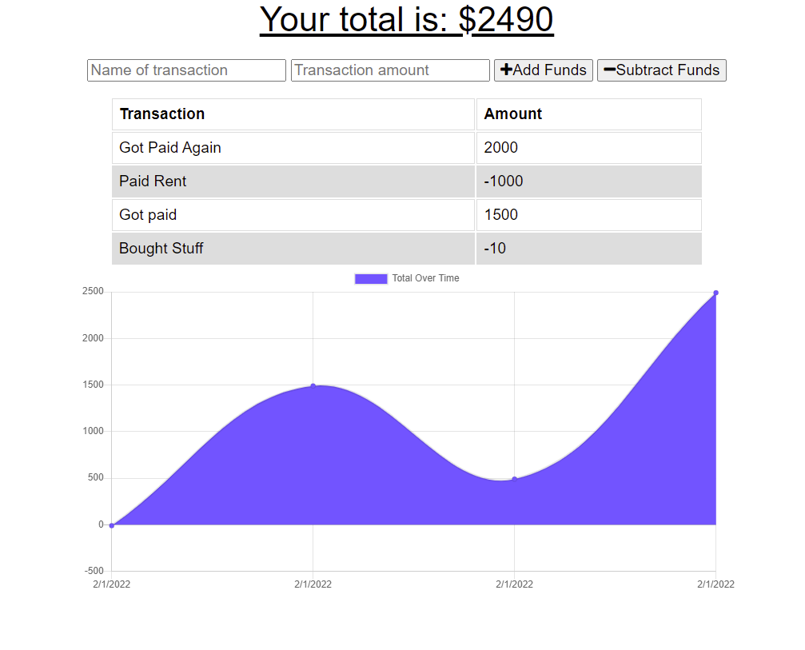

# Jeff's Budget Tracker

## Deployed Application
https://quiet-woodland-86058.herokuapp.com/

## Description
The purpose of this project was to convert an existing budget tracking application into a progressive web application.

## Screenshot

## Table Of Contents
* [Description](#description)
* [Installation](#installation)
* [Usage](#usage)
* [Contributing](#contributing)
* [Tests](#tests)
* [Credit](#credit)
* [Questions](#questions)
* [License](#license)

## Installation
Please use the following console command to install project dependancies: npm install

## Usage
Please use this project to keep track of your personal finances.

## Contributing
Please send me an email if you'd like to contribute to this project.

## Tests
There are no tests for this project.

## Credit
Created By: Jeffrey Brittingham  
Creator Github Profile: https://github.com/JBGinger

## Questions
Have any questions about this project? Please send me an email at jeff.brittingham@protonmail.com.
Feel free to take a look at this project's Github repository (along with my other work) on my Github profile: https://github.com/JBGinger.

## License 
  Licensed Under: None  
  License Link: None
  
